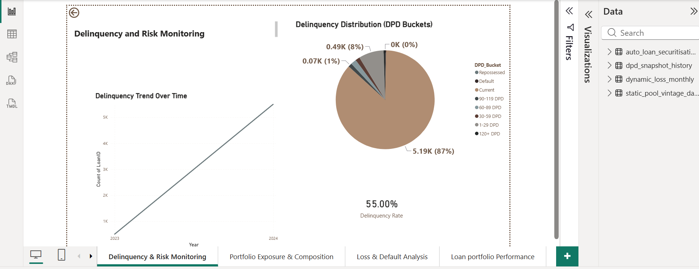
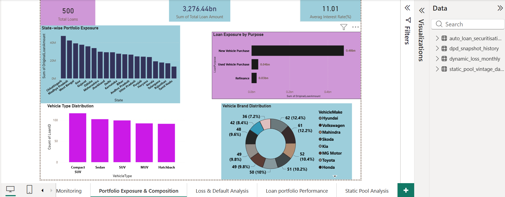
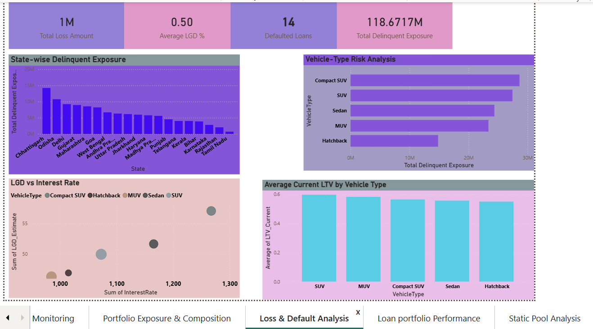
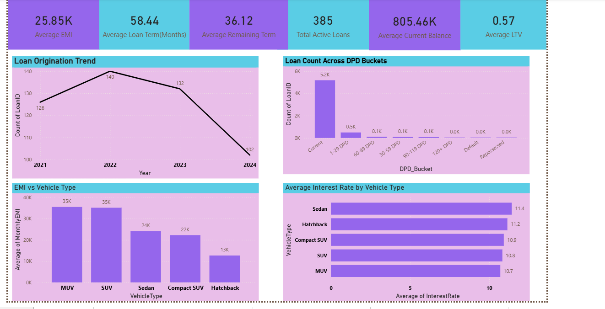
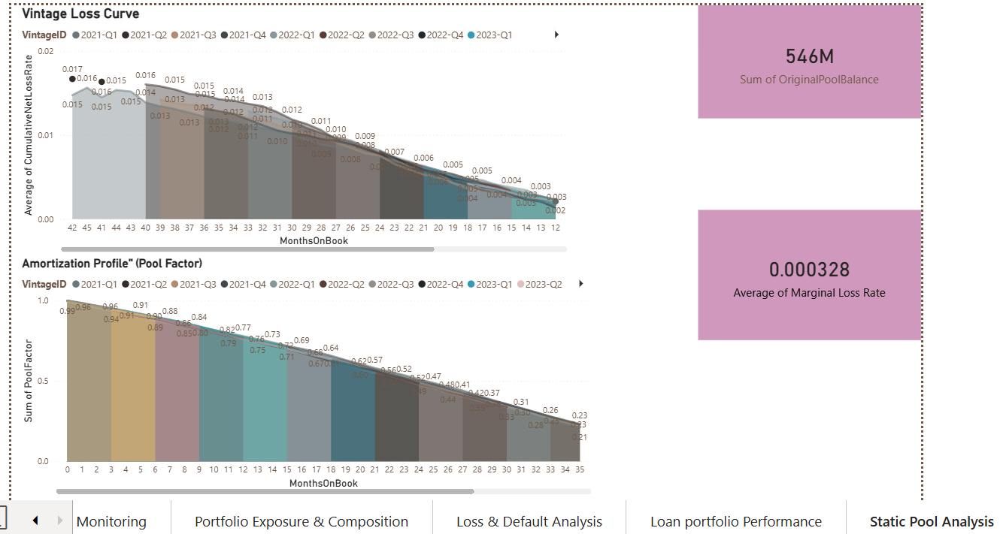

# Vehicle Loan Risk & Portfolio Credit Analysis

## 🔒 Data Privacy & Compliance Notice
> **Note on Data Protection:** To strictly comply with data privacy regulations and non-disclosure agreements, the raw financial dataset and interactive `.pbix` file for this project have been withheld. The architecture, complex modeling, and visualizations showcased below use anonymized and aggregated metrics to demonstrate data engineering and credit risk analytics capabilities.

---

## 📊 Project Overview
This 5-page Credit Risk framework evaluates a vehicle loan portfolio. The dashboard tracks delinquency metrics, flags geographic concentrations, and details asset-class default exposures. It incorporates Credit Vintage Curves and Pool Amortization to map loan pool decay and optimize risk mitigation across the entire portfolio lifecycle.

---

## 🖥️ Dashboard Architecture & Page Breakdown

### 📌 Page 1: Delinquency & Risk Monitoring
* **Objective:** High-level summary of baseline portfolio health and tracking macro delinquency velocity.
* **Key Metrics & Visuals:** 
  * Metrics: Delinquency Rate (55.00%), Total Active Loans (385), Average Current Balance ($805.46K), and Average LTV (0.57).
  * Charts: A **Delinquency Trend Over Time** line chart showcasing volume spikes between 2023 and 2024[cite: 1], alongside a **Delinquency Distribution** pie chart indicating that **87% (5.19K loans)** remain in 'Current' status[cite: 1].
 

---

### 📌 Page 2: Portfolio Exposure & Composition
* **Objective:** Analyzing geographical capital concentrations and asset-class demographic allocations.
* **Key Metrics & Visuals:**
  * Charts: **State-wise Portfolio Exposure** (led heavily by Chhattisgarh and Madhya Pradesh) and a multi-sliced **Vehicle Brand Distribution** (led by Hyundai at 12.4% and Volkswagen at 12.2%).
  * Yield Trackers: Cross-filtering supported by an **Average Interest Rate KPI card sitting at 11.01%**.

---

### 📌 Page 3: Loss & Default Analysis
* **Objective:** Isolating financial vulnerability and Loss Given Default (LGD) metrics against asset types.
* **Key Metrics & Visuals:**
  * Metrics: **Total Delinquent Exposure ($118.67M)**, Total Loss Amount ($1M), and Average LGD (50%).
  * Charts: An **LGD vs Interest Rate** scatter plot matrix and a **Vehicle-Type Risk Analysis** bar chart showing Compact SUVs and SUVs as the highest-risk contributors.
 

---

### 📌 Page 4: Loan Portfolio Performance
* **Objective:** Documenting historic growth pipelines alongside customer monthly repayment profiles.
* **Key Metrics & Visuals:**
  * Charts: A **Loan Origination Trend** documenting volume shifts from 2021 through 2024 (peaking in 2022 at 140 loans) and an **EMI vs Vehicle Type** chart contrasting MUV/SUV outlays (~$35K) against Hatchbacks (~$13K).
 

---

### 📌 Page 5: Vintage & Amortization Analysis
* **Objective:** Advanced credit risk modeling mapping lifecycle decay and loss stabilization across loan cohorts.
* **Key Metrics & Visuals:**
  * Charts: A **Vintage Loss Curve** tracking the Average Cumulative Net Loss Rate across Months on Book (MOB) to identify loss seasoning boundaries, paired with a stepping **Amortization Profile (Pool Factor)** displaying pool erosion down to 0.23 by month 35.
  

---

## 🛠️ Technical Competencies Demonstrated
* **Advanced Financial Modeling:** Developed structural Cohort Analysis (Vintage Curves) and Pool Amortization schedules using Power BI time intelligence.
* **Data Cleansing & ETL:** Structured Power Query schemas to map disparate variables across dynamic Days Past Due (DPD) buckets.
* **DAX Engineering:** Authored calculations for multi-layered credit matrices, weighted averages, and moving cumulative loss rates.

---

## 🎯 Strategic Business Recommendations (Data-Driven Insights)

Based on the portfolio's credit performance, geographic risk distribution, and vintage loss curves, the following strategic actions are recommended to optimize the lending framework and mitigate future credit losses:

### 1. Tighten the Credit Box for High-Risk Vehicle Segments
* **Observation:** **Compact SUVs and SUVs** represent the highest concentration of risk, driving the largest shares of the portfolio's **$118.67M Total Delinquent Exposure**. This vulnerability is highly correlated with elevated Loan-to-Value (LTV) ratios averaging around **0.6**.
* **Actionable Recommendation:** Implement a strict policy cap reducing maximum allowable LTVs to **0.50** specifically for the SUV and Compact SUV asset classes. Lowering leverage at origination will structurally decrease the Loss Given Default (LGD) estimates.

### 2. Implement Geographic Caps and Enhanced Underwriting in Chhattisgarh
* **Observation:** While **Chhattisgarh** commands the single highest capital allocation in original loan amounts (exceeding 40M), it also stands out as a leading driver of **Total Delinquent Exposure**. The risk profile here is highly disproportionate to its baseline portfolio size.
* **Actionable Recommendation:** Establish an immediate geographic exposure cap on new originations out of Chhattisgarh to diversify regional risk. Additionally, introduce mandatory, more stringent debt-to-income (DTI) or credit score thresholds for any new applicants routing from this territory.

### 3. Restructure Collections Pricing Models Based on Asset Class Outlays
* **Observation:** **MUVs and SUVs** demand the heaviest monthly repayment strains on consumers, averaging **~$35K in Monthly EMI**, compared to a light entry-level average of **13K for Hatchbacks**. 
* **Actionable Recommendation:** Because high-EMI asset classes face greater structural pressure during economic downturns, the collection team should prioritize early-intervention strategies (pre-delinquency automated SMS and grace-period communication) for accounts with EMIs exceeding 30K.

### 4. Optimize Provisioning Reserves Based on Vintage "Seasoning" Peak
* **Observation:** The **Vintage Loss Curve** indicates a highly predictable seasoning pattern where Cumulative Net Losses scale upward through the lifecycle before structurally flattening out and stabilizing between **36 to 42 Months on Book (MOB)**. Concurrently, the **Pool Factor** shows capital liquidates down to **0.23** by month 35.
* **Actionable Recommendation:** Capital adequacy reserves and bad-debt provisioning should be calculated dynamic to this curve. The organization can optimize capital allocation by maintaining higher risk-reserves for active loan pools between 12 to 36 MOB, and safely releasing capital back to the business once a cohort crosses the 36-month "seasoned" milestone without defaulting.
